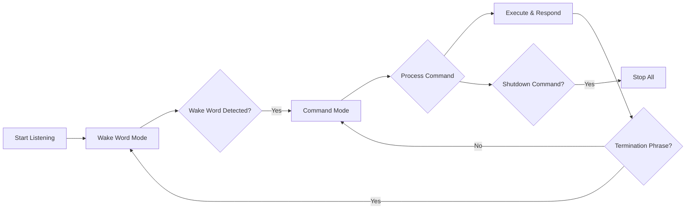

# BevPro Studio - Professional Voice Agent Platform

<div align="center">
  
  
  [](https://vercel.com/new/clone?repository-url=https://github.com/yourusername/bpstudio)
  [](LICENSE)
  [](https://web.dev/progressive-web-apps/)
</div>

## 🚀 Overview

BevPro Studio is a state-of-the-art voice agent platform designed for event venues and bars. Build, customize, and deploy professional voice assistants with ultra-low latency and multi-provider support.

### ✨ Key Features

- **🎙️ Advanced Wake Word Detection**: Browser-based wake word detection with fuzzy matching
- **🔊 Multi-Provider Voice Support**: Eleven Labs, Google Cloud TTS/STT, Play.ht, OpenAI
- **⚡ Ultra-Low Latency**: Sub-100ms response times with WebRTC and streaming
- **🎨 Smarticus81 v0 Templates**: Premium UI templates for instant professional interfaces
- **📱 PWA Ready**: Full Progressive Web App support with offline capabilities
- **☁️ Supabase Integration**: Vector search and data management with MCP
- **🚀 One-Click Deploy**: Vercel deployment with automatic configuration

## 🛠️ Technology Stack

- **Frontend**: Next.js 14, React 18, TypeScript, Tailwind CSS
- **Voice**: OpenAI Realtime API, Eleven Labs, Google Cloud Speech
- **Database**: Convex, Supabase (with PGVector)
- **UI Generation**: v0 by Vercel, Smarticus81 Templates
- **Deployment**: Vercel, PWA, Edge Functions
- **Auth**: Clerk

## 📦 Installation

### Prerequisites

- Node.js 18+ and pnpm
- Clerk account for authentication
- Convex account for database
- OpenAI API key
- Optional: Eleven Labs, Google Cloud, Supabase accounts

### Quick Start

1. **Clone the repository**
```bash
git clone https://github.com/yourusername/bpstudio.git
cd bpstudio
```

2. **Install dependencies**
```bash
pnpm install
```

3. **Set up environment variables**
```bash
cp .env.example .env.local
# Edit .env.local with your API keys
```

4. **Initialize Convex**
```bash
pnpm convex dev
```

5. **Run the development server**
```bash
pnpm dev
```

6. **Open in browser**
```
http://localhost:3000
```

## 🎯 Voice Agent Flow

### Wake Word Detection Flow



### Supported Wake Words

- **Bar Operations**: "Hey Bar", "Hey Bartender"
- **Venue Management**: "Hey Bev", "Hey Venue"
- Customizable per agent with fuzzy matching

## 🎨 UI Customization

### Smarticus81 v0 Templates

Choose from premium templates:
- **Venue Pro Dashboard**: Professional venue management
- **Bar Elite Interface**: Premium bar operations
- **Event Master Control**: Comprehensive event management
- **Smart Booking Flow**: Intelligent reservation system

### Template Integration

```typescript
import { smarticus81 } from '@/lib/smarticus-v0-integration';

const ui = await smarticus81.generateFromTemplate('smarticus-venue-pro', {
  name: 'My Venue Agent',
  type: 'Event Venue',
  primaryColor: '#10a37f',
  secondaryColor: '#0ea5e9'
});
```

## 🔊 Voice Provider Configuration

### Eleven Labs (Recommended for Quality)
```typescript
{
  provider: 'elevenlabs',
  apiKey: process.env.NEXT_PUBLIC_ELEVENLABS_API_KEY,
  voice: 'rachel', // Premium voice
  streaming: true, // Ultra-low latency
  model: 'eleven_turbo_v2'
}
```

### Google Cloud (Best for Transcription)
```typescript
{
  provider: 'google',
  apiKey: process.env.NEXT_PUBLIC_GOOGLE_API_KEY,
  voice: 'en-US-Neural2-F',
  model: 'latest_long'
}
```

## 📊 Data Management

### Supabase Integration

Upload and manage venue data with vector search:

```typescript
import { supabaseManager } from '@/lib/supabase-client';

// Upload inventory
await supabaseManager.uploadInventory(agentId, inventoryData);

// Vector search
const results = await supabaseManager.searchVectorData(
  agentId, 
  "What drinks are available?",
  5
);
```

## 🚀 Deployment

### Deploy to Vercel

1. **Push to GitHub**
```bash
git add .
git commit -m "Initial deployment"
git push origin main
```

2. **Import to Vercel**
- Visit [vercel.com/new](https://vercel.com/new)
- Import your repository
- Configure environment variables
- Deploy

3. **Configure Domain**
```bash
vercel domains add yourdomain.com
```

### PWA Configuration

The platform is PWA-ready with:
- Offline support
- Install prompts
- Push notifications (coming soon)
- Background sync

## 🔧 API Endpoints

### Agent API
```typescript
POST /api/agent-api
{
  agentId: string;
  message: string;
  type: 'voice' | 'text';
}
```

### UI Generation
```typescript
POST /api/generate-ui
{
  name: string;
  type: string;
  customization: UICustomization;
}
```

### Voice Session
```typescript
POST /api/voice-session
{
  agentId: string;
  action: 'start' | 'stop';
}
```

## 📱 PWA Features

- **Install**: Add to home screen on mobile/desktop
- **Offline**: Works without internet (cached content)
- **Updates**: Auto-updates in background
- **Shortcuts**: Quick actions from home screen

## 🧪 Testing

### Run Tests
```bash
pnpm test
pnpm test:e2e
```

### Test Voice Features
1. Navigate to `/test-agent`
2. Enter agent ID and deployment ID
3. Click "Deploy Agent"
4. Test wake word: "Hey Bev"
5. Give commands
6. Say "Stop listening" to end

## 🤝 Contributing

We welcome contributions! Please see [CONTRIBUTING.md](CONTRIBUTING.md) for details.

## 📄 License

MIT License - see [LICENSE](LICENSE) for details.

## 🆘 Support

- Documentation: [docs.bevpro.studio](https://docs.bevpro.studio)
- Discord: [discord.gg/bevpro](https://discord.gg/bevpro)
- Email: support@bevpro.studio

## 🙏 Acknowledgments

- OpenAI for Realtime API
- Eleven Labs for premium voices
- Smarticus81 for v0 templates
- Vercel for hosting and v0
- All our contributors

---

<div align="center">
  Built with ❤️ by the BevPro Team
</div>